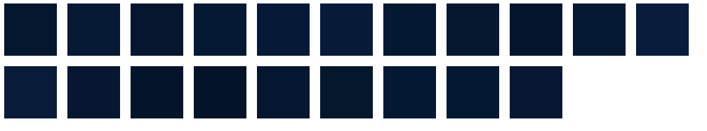

## 功能背景

页面的背景色取决于图片的主题色，并且用户可以手动从图片中取出目标色值

## 效果演示


## 实现思路

首先是获取图片主色，获取图片主色为一个单独的功能，其主要原理就是利用`canvas`的`drawImage`和`getImageData`两个API，先通过`drawImage`将图片画在canvas上，然后通过`getImageData`得到一个数组，该数组每一项为每一个像素点对应的色值。有了这个数组，对于获取图片主题色就相当于记录数组中每一个色值出现的次数，然后按数量从大到小排序，第一项为出现最多的色值既可作为图片的主题色，而手动取色功能就是根据鼠标位置，从数组中取对应的色值。


获取图片主色功能主要代码实现与使用
```js
class ImgColorPick {
  /**
   * @param {HTMLImageElement | string} el 图片元素
   */
  constructor(el) {
    this.el = el

    if (typeof el === 'string') {
      this.src = el
    } else {
      this.src = el.getAttribute('src')
    }
  }

  /**
   * 获取图片主色
   * @param {object} options 
   */
  async getImgColor(options) {
    const defaultOptions = {
      ignore: [], // 忽略的色值，rgb格式字符串
      scale: 1, // 默认为1，表示是否取整张图片的色值，取值范围为0-1
      length: 8, // 图片主色返回多少个，默认返回8个

      // rgb色值范围，默认全部色值
      r: [0, 255],
      g: [0, 255],
      b: [0, 255]
    }

    options = { ...defaultOptions, ...options }

    const data = await getImageData(this.src, { scale: options.scale })

    return getCounts(data, options).map((item) => item.color)
  }
}
```
通过定义一个`ImgColorPick`类，`ImgColorPick`的`constructor`接收一个dom节点或者一个图片链接，如果接收的是dom节点就从节点上取出src属性的值，从而得到图片的链接，传入dom节点实际是为后续根据鼠标位置取色做准备，ImgColorPick实例身上有一个`getImgColor`方法，调用该方法即可获取图片主色。获取主色时也添加了一些配置，`ignore`表示忽略哪些颜色，`scale`表示是否取整张图片的色值，取值范围为0-1，`length`表示返回多少个色值，r、g、b分别表示对应的取色范围，可以通过配置该三项来取一定范围内的颜色。


基本使用
```html
<script setup>
import { onMounted, ref } from 'vue'
import ImgColorPick from './components/ImageColorPick'

const imgUrl = 'https://img2.baidu.com/it/u=3849054932,2988350768&fm=253&app=120&size=w931&n=0&f=JPEG&fmt=auto?sec=1680022800&t=77f347d9193d5608690cb9de8101471d'

const options = {
  length: 20,
  // r: [50, 255],
  // g: [50, 255],
  // b: [50, 255]
}
let colorPick = null
const imgRef = ref('')

const colorArr = ref([])

onMounted(() => {
  colorPick = new ImgColorPick(imgRef.value)
})

const getMainColor = () => {
  colorPick.getImgColor(options).then(res => {
    colorArr.value = res
  })
}
</script>

<template>
  <div>
    <button @click="getMainColor">获取图片主色</button>
  </div>

  

  <div class="flex-box">
    <div class="color-block" v-for="item in colorArr" :key="item" :style="{ backgroundColor: item }"></div>
  </div>
</template>
```

没设置范围前取的主题色


设置范围后取出的主题色


根据鼠标位置取色功能实际就是在取图片主色功能基础之上的功能，大致的代码实现如下
```js
import { getCounts, getImageData } from './color'

class ImgColorPick {
  /**
   * 开启鼠标在图片上进行取色
   */
  async start() {
    // ...
  }
}

class Magnifier {
  constructor(colorArr, rectNum, rectSize, imgWidth, imgHeight, zIndex = 100000) {
    this.colorArr = colorArr
    this.rectNum = rectNum
    this.rectSize = rectSize
    this.width = rectNum * rectSize
    this.height = rectNum * rectSize
    this.zIndex = zIndex

    this.imgWidth = imgWidth
    this.imgHeight = imgHeight
  }

  /**
   * 创建放大镜元素
   */
  create() {
    if (this.el) return
    const container = document.createElement('div')
    const canvas = document.createElement('canvas')
    canvas.width = this.width
    canvas.height = this.height

    container.style.position = 'absolute'
    container.style.left = 0
    container.style.top = 0
    container.style.zIndex = this.zIndex
    container.style.display = 'none'

    this.magnifierContext = canvas.getContext('2d')

    this.el = container
    container.appendChild(canvas)
    document.body.appendChild(this.el)
  }

  /**
   * 销毁
   */
  destroy() {
    // ...
  }

  /**
   * 显示
   */
  show(x, y, mX, mY) {
    this.el.style.display = 'block'
    // 设置位置
    this.el.style.transform = `translate(${x + 25}px, ${y + 25}px)`

    // 画放大镜
    const rectNumHalf = (this.rectNum - 1) / 2
    // 形成11 * 11的矩阵
    for (let y = 0; y < this.rectNum; y++) {
      for (let x = 0; x < this.rectNum; x++) {
        const curX = mX - rectNumHalf + x
        const curY = mY - rectNumHalf + y
        this.magnifierContext.beginPath()
        const colorObj = ImgColorPick.getColor(curX, curY, this.imgWidth, this.imgHeight, this.colorArr)
        this.magnifierContext.fillStyle = `rgb(${colorObj.r}, ${colorObj.g}, ${colorObj.b})`
        // 每个格子10像素
        this.magnifierContext.rect(x * this.rectSize, y * this.rectSize, this.rectSize, this.rectSize)
        this.magnifierContext.fill()
        this.magnifierContext.strokeStyle = '#000'
        this.magnifierContext.lineWidth = '0.1'
        this.magnifierContext.stroke()
      }
    }
    // 后画中心点样式
    this.magnifierContext.lineWidth = '2'
    this.magnifierContext.strokeRect(rectNumHalf * this.rectSize, rectNumHalf * this.rectSize, this.rectSize, this.rectSize)
  }

  /**
   * 隐藏
   */
  hidden() {
    // ...
  }
}
```

在`ImgColorPick`上新增一个start方法，调用该方法后，鼠标移入指定图片就会出现放大镜，点击后取出当前鼠标位置的颜色。具体放大镜的实现也是新增一个`Magnifier`类进行管理，放大镜的绘制实际是在绘制11 * 11个小方格，中心小方格的填充色为当前鼠标位置对应的色值。

使用上也很简单
```html
<script setup>
import { onMounted, ref } from 'vue'
import ImgColorPick from './components/ImageColorPick'

// const curColor = ref('')
const imgUrl = 'https://img2.baidu.com/it/u=3849054932,2988350768&fm=253&app=120&size=w931&n=0&f=JPEG&fmt=auto?sec=1680022800&t=77f347d9193d5608690cb9de8101471d'
let colorPick = null
const imgRef = ref('')

onMounted(() => {
  colorPick = new ImgColorPick(imgRef.value)
})

const startColorPick = () => {
  colorPick.start()
}
</script>

<template>
  <div>
    <button @click="startColorPick">开始取色</button>
  </div>

  
</template>
```